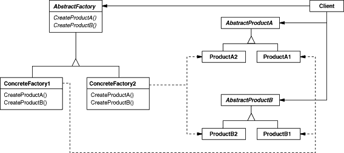

# 1. 추상 팩토리 \(Abstract Factory\)

## **의도**

상세화된 서브클래스를 정의하지 않고도 서로 관련성이 있거나 독립적인 여러 객체의 군을 생성하기 위한 인터페이스를 제공합니다.

## **다른 이름**

키트\(Kit\)

## **활용성**

추상 팩토리는 다음의 경우에 사용합니다.

* 객체가 생성되거나 구성, 표현되는 방식과 무관하게 시스템을 독립적으로 만들고자 할 때
* 여러 제품군 중 하나를 선택해서 시스템을 설정해야 하고 한번 구성한 제품을 다른 것으로 대체할 수 있을 때
* 관련된 제품 객체들이 함께 사용되도록 설계되었고, 이 부분에 대한 제약이 외부에도 지켜지도록 하고 싶을 때
* 제품에 대한 클래스 라이브러리를 제공하고, 그들의 구현이 아닌 인터페이스를 노출시키고 싶을 때

## **구조**

## **결과**

추상 팩토리 패턴을 쓰면서 얻는 이익과 부담은 다음과 같습니다.

#### **구체적인 클래스를 분리합니다.**

팩토리는 제품 객체를 생성하는 과정과 책임을 캡슐화한 것이기 때문에, 구체적인 구현 클래스가 사용자에게서 분리됩니다. 제품 클래스 이름이 구체 팩토리의 구현에서 분리되므로, 사용자 코드에는 나타나지 않는 것입니다.

#### **제품군을 쉽게 대체할 수 있도록 합니다.**

일반적으로 구체 팩토리의 클래스는 응용프로그램에서 한 번만 나타나기 때문에 응용프로그램이 사용할 구체 팩토리를 변경하기는 쉽습니다. 추상 팩토리는 필요한 모든 것을 생성하기 때문에 전체 제품군은 한번에 변경이 가능합니다.

#### **제품 사이의 일관성을 증진시킵니다.**

하나의 군 안에 속한 제품 객체들이 함께 동작하도록 설계되어 있을 때, 응용프로그램은 한 번에 오직 한 군에서 만든 객체를 사용하도록 함으로써 프로그램의 일관성을 갖도록 해야 합니다.

#### **새로운 종류의 제품을 제공하기 어렵습니다.**

새로운 종류의 제품을 만들기 위해 기존 추상 팩토리를 확장하기가 쉽지 않습니다. 만약 새로운 종류의 제품이 등장하면 팩토리의 구현을 변경해야 합니다. 이는 추상 팩토리와 모든 서브클래스의 변경을 가져옵니다.

## **구현**

#### **팩토리를 단일체\(Singeltone\)로 정의합니다.**

전형적으로 응용프로그램은 한 제품군에 대해서 하나의 ConcreteFactory 인스턴스만 있으면 됩니다. 그러므로 단일체로 구현하는 것이 바람직합니다.

#### **제품을 생성합니다.**

AbstractFactory는 단지 제품을 생성하기 위한 인터페이스를 선언하는 것이고, 그것을 생성하는 책임은 AbstractFactory의 서브클래스인 ConcreteFactory에 있습니다. ConcreteFactory에서 AbstractFactory의 메서드를 overriding 함으로써 각 제품의 인스턴스를 만드는 방법은 간단하지만, 제품군이 약간만 달라도 새로운 ConcreteFactory 가 필요하게 됩니다. 많은 제품군이 가능하다면 ConcreteFactory는 Prototype Pattern을 이용해서 구현할 수도 있습니다.

#### **확장 가능한 팩토리들을 정의합니다.**

 CreateProductA\(\), CreatedProductB 와 같이 제품들의 종류에 따라 메서드를 정의할 수도 있지만, 제품의 식별자를 인자로 받는 Make\(\) 함수 하나를 정의함으로써 유연한 인터페이스를 구현할 수 도 있습니다. 이는 C++ 같은 정적 타입 언어보다는 스몰토크와 같은 동적 타입 언어에서 더 쉽게 사용할 수 있습니다.

## **의견**

java의 swing에서 mac, windows를 동시에 지원하는 방법을 예시로 떠올리면 쉽다.

