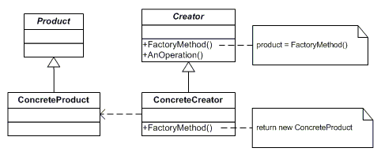

# 3. 팩토리 메서드 \(Factory Method\)

## **의도**

객체를 생성하기 위해 인터페이스를 정의하지만, 어떤 클래스의 인스턴스를 생성할지에 대한 결정은 서브클래스가 내리도록 합니다.

## **다른 이름**

가상 생성자\(Virtual Constructor\)

## **활용성**

팩토리 메서드는 다음과 같은 상황에 사용합니다.

* 어떤 클래스가 자신이 생성해야 하는 객체의 클래스를 예측할 수 없을 때
* 생성할 객체를 기술하는 책임을 자신의 서브클래스가 지정했으면 할 때
* 객체 생성의 책임을 몇 개의 보조 서브클래스 가운데 하나에게 위임하고, 어떤 서브클래스가 위임자인지에 대한 정보를 국소화시키고 싶을 때

## **구조**

## **결과**

팩토리 메서드 패턴은 응용프로그램에 국한된 클래스가 여러분의 코드에 종속되지 않도록 해 줍니다. 응용프로그램은 Product 클래스에 정의된 인터페이스와만 동작하도록 코드가 만들어지기 때문에, 사용자가 정의한 어떤 ConcreteProduct 클래스와도 동작할 수 있게 됩니다.

팩토리 메서드의 잠재적인 단점은 사용자가 ConcreteProduct 객체 하나만 만들려 할 때에도 Creator 클래스를 서브클래싱해야 할지 모른다는 점입니다. 팩토리 메서드 패턴을 쓰면서 얻는 결과는 다음과 같이 두 가지가 더 있습니다.

#### **서브클래스에 대한 훅\(hook\) 메서드를 제공합니다.**

#### **병렬적인 클래스 계통을 연결하는 역할을 담당합니다.**

## **구현**

#### **구현 방법이 크게 두 가지입니다.**

1. Creator 클래스를 추상 클래스로 정의하고, 정의한 팩토리 메서드에 대한 구현은 제공하지 않는 경우
2. Creator가 구체 클래스이고, 팩토리 메서드에 대한 기본 구현을 제공하는 경우

#### **팩토리 메서드를 매개변수화합니다.**

또 다른 구현 방식으로, 팩토리 메서드가 매개변수를 받아서 어떤 종류의 제품을 생성할지 식별하게 만드는 것입니다.

#### **언어마다 구현 방법이 조금 다를 수 있습니다.**

#### **템플릿을 사용하여 서브클래싱을 피합니다.**

팩토리 메서드를 쓰면 생길 수 있는 잠재적인 문제점 중 하나는 그냥 Product 클래스 하나를 추가하려 할 때마다 서브클래싱을 해야 한다는 점입니다. c++의 template 클래스 혹은 java의 generic을 활용하면 이를 피할 수 있습니다.

#### **명명 규칙을 따르는 것도 매우 중요한 일입니다.**

팩토리 메스드를 쓴다는 사실을 명확하게 만들어 주는 명명 규칙을 따르는 좋은 습관을 들이도록 합시다.

## **의견**

추상 팩토리 패턴과의 비교: 템플릿 메서드 패턴을 사용했다는 점에서는 같으나, 팩토리 메서드 패턴은 한 메서드가 여러가지 종류의 객체를 생성하는 것이고, 추상 팩토리 패턴은 다양한 메서드가 한 '군'의 객체들을 생성해낸다는 차이점이 있다. [참조](http://jusungpark.tistory.com/14)

