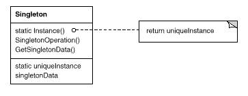

# 5. 단일체 \(Singleton\)

## **의도**

오직 한 개의 클래스 인스턴스만을 갖도록 보장하고, 이에 대한 전역적인 접근점을 제공합니다.

## **활용성**

단일체 패턴은 다음 상황에서 사용합니다.

* 클래스의 인스턴스가 오직 하나여야 함을 보장하고, 잘 정의된 접근점으로 모든 사용자가 접근할 수 있도록 해야 할 때
* 유일한 인스턴스가 서브클래싱으로 확장되어야 하며, 사용자는 코드의 수정 없이 확장된 서브클래스의 인스턴스를 사용할 수 있어야 할 때

## **구조**



## **결과**

단일체 패턴이 갖는 장점들을 보면 다음과 같습니다.

#### **유일하게 존재하는 인스턴스로의 접근을 통제합니다.**

Singleton 클래스 자체가 인스턴스를 캡슐화하기 때문에, 이 클래스에서 사용자가 언제, 어떻게 이 인스턴스에 접근할 수 있는지 제어할 수 있습니다.

#### **이름 공간\(name space\)을 좁힙니다.**

단일체 패턴은 전역 변수보다 더 좋습니다. 전역 변수를 사용해서 이름 공간을 망치는 일을 없애주기 때문입니다. 즉, 전역 변수를 정의하여 발생하는 디버깅의 어려움 등 문제를 없앱니다.

#### **연산 및 표현의 정제를 허용합니다.**

Singleton클래스는 상속될 수 있기 때문에, 이 상속된 서브클래스를 통해서 새로운 인스턴스를 마들 수 잇습니다. 또한 이 패턴을 사용하면, 런타임에 필요한 클래스의 인스턴스를 써서 응용프로그램을 구성할 수도 있습니다.

#### **인스턴스의 개수를 변경하기가 자유롭습니다.**

Singleton 클래스의 인스턴스에 접근할 수 있는 허용 범위를 결정하는 연산만 변경하면 됩니다.

#### **클래스 연산을 사용하는 것보다 훨씬 유연한 방법입니다.**

단일체 패턴과 동일한 기능을 발휘하는 방법이 클래스 연산을 사용하는 것입니다. \(static method\). 이러한 방법을 사용할 때에는 클래스의 인스턴스가 하나 이상 존재할 수 있도록 설계를 변경하는 것은 어렵습니다. 또한 static method는 서브클래스들이 이 연산을 오버라이드할 수 없습니다.

## **구현**

단일체 패턴을 사용할 때의 고려 사항은 다음과 같습니다.

#### **인스턴스가 유일해야 함을 보장합니다.**

 가장 일반적인 방법은 인스턴스를 생성하는 연산을 클래스 연산\(static method\)로 만드는 것입니다.

```java
class Singleton {
public:
  static Singleton* Instance();
protected:
  Singleton();
private:
  static Singletone* _instance;
}

Singleton* Singleton::_instance = 0;
Singleton* Singleton::Instance () {
  if (_instance == 0) {
    _instance = new Singleton;
  }
  return _instance;
}
```

C++을 사용한 구현에서 한 가지 더 짚고 넘어갈 것은, 단일체를 전역 변수나 정적 객체로 정의하고 이를 자동 초기화하는 것만으로는 충분하지 않다는 것입니다. 그 이유는 다음과 같습니다.

\(a\) 정적 객체의 유일한 인스턴스만 선언되리라는 보장을 할 수 없습니다. 즉, 정적 객체에서 인스턴스를 얻는 선언문이 프로그램 다른 부분에 존재하더라도 이를 확인하고 방지할 방법이 없다는 것입니다.

\(b\) 정적 초기화 시점에 모든 단일체를 인스턴스화하기 위해 필요한 모든 정보가 없을 수도 있습니다.

\(c\) C++에서는 전역 객체에 대한 생성자를 언제 호출하는지에 대한 명확한 순서를 정의하지 않습니다. 이 말은 단일체 사이에는 어떠한 종속성도 없음을 의미합니다.

#### **Singleton 클래스를 서브클래싱합니다.**

서브클래스를 만드는 것이 중요한 게 아니라, 이 새로운 서브클래스의 유일한 인스턴스를 만들어 사용자가 이를 사용할 수 있도록 하는 것입니다. 이를 지원하는 방법으로는, Instance\(\) 연산에서 어떤 단일체를 사용할지 결정하는 방법, Instance\(\)연산의 구현을 서브클래스에서 하게 하는 방법, 좀 더 유연한 방법으로는 단일체에 대한 레지스트리를 사용하는 방법이 있습니다.

