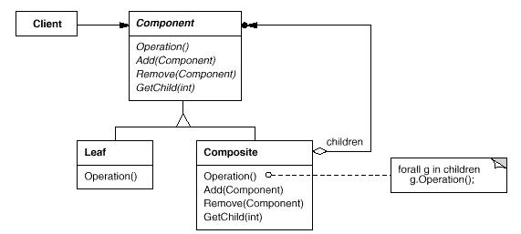

# 3. 복합체 \(Composite\)

## **의도**

부분과 전체의 계층을 표현하기 위해 객체들을 모아 트리 구조로 구성합니다. 사용자로 하여금 개별 객체와 복합 객체를 모두 동일하게 다룰 수 있도록 하는 패턴입니다.

## **활용성**

복합체 패턴은 다음과 같은 경우에 사용합니다.

* 부분 - 전체의 객체 계통을 표현하고 싶을 때
* 사용자가 객체의 합성으로 생긴 복합 객체와 개개의 객체 사이의 차이를 알지 않고도 자기 일을 할 수 있도록 만들고 싶을 때. 사용자는 복합 구조의 모든 객체를 똑같이 취급하게 됩니다.

## **구조**



## **결과**

#### 기본 객체와 복합 객체로 구성된 하나의 일관된 클래스 계통을 정의의합니다.

사용자 코드는 일반화된 상위 개념의 객체를 조작하는 방식으로 프로그래밍하면, 런타임 기본 객체와 복합 객체를 구분하지 않고 일관되게 프로그래밍할 수 있게 됩니다.

#### 사용자의 코드가 단순해집니다.

사용자 코드는 복합 구조이나 단일 객체와 동일하게 다루는 코드로 작성되기 때문입니다. 이런 구분이 필요치 않으므로 코드에 "코리표 - case - 문장" 스타일의 함수를 쓸 필요가 없어지므로 코드가 단순해집니다.

#### 새로운 종류의 구성요소를 쉽게 추가할 수 있습니다.

#### 설계가 지나치게 범용성을 많이 가집니다.

새로운 요소를 쉽게 추가할 때의 단점은 복합체의 구성요소에 제약을 가하기 힘들다는 것입니다. 복합체가 오직 한 개의 구성요소만 가졌으면 할 때에는 런타임 점검이 반드시 들어가야 합니다.

## **구현**

복합체 패턴을 구현할 때 고려할 사항을 정리하면 다음과 같습니다.

#### **포함 객체에 대한 명확한 참조자**

자식 구성요소에서 부모를 가리키는 참조자를 관리하면 복합체 구조의 관리를 단순화할 수 있습니다. 

#### **구성요소 공유**

한 자식이 여러 부모를 갖게 하여 구성요소를 공유한다.

#### **Component 인터페이스를 최대화**

복합체 패턴의 주요 목표 중 하나는 사용자가 어떤 Leaf나 Composite 클래스가 존재하는지 모르도록 하는 것입니다. 이런 목표를 달성하려면, Component 클래스는 Composite와 Leaf에 정의된 모든 공통의 연산을 다 정의하고 있어야 합니다.

#### **자식을 관리하는 연산 선언**

Composite 클래스가 Add\(\)와 Remove\(\) 연산을 통해서 자식들을 관리하기는 하지만, 복합체 패턴에서 매우 중요한 관심사는 Composite 클래스 계통 내의 어느 클래스에 이 연산을 선언할 것인가 결정하는 것입니다. 이 연산들을 Component에 선언하고 Leaf 클래스에도 의미 있는 연산으로 만들까요, 아니면 Composite 클래스와 이 서브클래스에만 의미 있는 연산으로 선언할까요?

이 결정은 안전성과 투명성 사이에 양자택일의 어려운 숙제를 냅니다.

자식을 관리하는 인터페이스를 클래스 계통의 최상위 클래스에 정의하면, 이를 사용하는 사용자에게 인터페이스의 투명성을 부여할 수 있습니다. 반대로 사용자가 Leaf 클래스의 인스턴스에게 Add\(\)나 Remove\(\) 연산을 호출하는 의미 없는 행동을 하지 않도록 안전성 유지를 위한 비용을 지불해야 합니다.

Composite 클래스에만 자식을 관리하는 연산을 정의한다면, 이를 사용하는 사용자는 아예 Leaf 클래스의 인스턴스에 이런 연산을 요청하지 않을 것이므로 안전성은 보장받습니다. 그러나 Leaf 클래스와 Composite 클래스가 서로 다른 인터페이스를 갖게 되므로 사용자는 이를 동일한 대상으로 간주하고 사용할 수 없게 됩니다.

우리는 이 패턴에서 안전성보다는 투명성을 더 강조하고 싶습니다. 만약 안전성을 선택한다면, 처리하는 대상 객체가 어떤 클래스에서 만들어진 것인지에 대한 타입 정보를 잃어버릴 수도 있으며 Component를 Composite로 변환해야 할 수도 있습니다. 타입 안전성 없는 캐스트를 쓰지 않으려면 어떤 방법으로 이것을 해결해야 할까요?

한 가지 방법은 Component 클래스에 다음 연산을 선언하는 것입니다.

```c
Composite* GetComposite();
```

Component 클래스에서는 이 연산의 기본 구현으로 널 포인터를 반환하고, Composite 클래스에서 자기 자신을 반환하도록 이 연산을 재정의합니다.

투명성을 보장하는 유일한 방법은 Component 클래스에 Add\(\)와 Remove\(\) 연산을 정의하는 것입니다. Leaf에서 이러한 연산을 시도한다면 오류 처리되도록 구현합니다.

#### **Component가 Component의 리스트를 구현할 수 있을까요?**

자식들 집합을 Componet 클래스의 인스턴스 변수로 관리하고 싶은 유횩에 빠질 수도 있습니다. 그러나 최상위 클래스에 자식 포인터를 정의하는 것은 모든 Leaf 클래스의 인스턴스들도 이 집합을 관리하기 위한 메모리를 정의해야 한다는 것이므로 별로 바람직하지 않습니다. 이 방법은 자식의 개수가 어느 정도 될 때만 가치 있는 방법입니다.

#### **자식 사이의 순서 정하기**

자식 간의 순서가 의미 있고 문제가 될 때는 자식에게 접근, 관리하는 인터페이스를 설계 시 자식들의 순서를 관리할 수 있도록 주의를 기울여야 합니다. 반복자 패턴이 이 부분에서는 도움을 줄 것입니다.

#### **성능 개선을 위한 캐싱\(caching\)**

#### **누가 구성요소를 삭제하는 책임을 질까요?**

#### **구성요소를 저장하기 위해 가장 적당한 데이터 구조는?**

Composite는 매우 다양한 데이터 구조를 이용해서 자신의 자식들을 저장할 수 있는데, 연결 리스트, 배역, 트리, 해시 테이블 모두가 구현 대상입니다. 해석자 패턴을 적용할 수도 있습니다.

## **의견**

트리 구조의 무언가를 구현할 때 유용한 패턴으로 하나의 큰 추상 클래스가 있고, 이를 상속받은 일부 구체 클래스에서 복수의 추상클래스 멤버 변수들을 관리하는 패턴. \(파워포인트의 grouping\).

