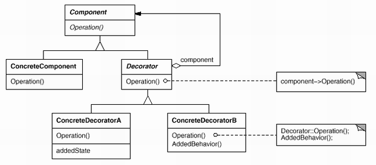

# 4. 장식자 \(Decorator\)

## **의도**

객체에 동적으로 새로운 책임을 추가할 수 있게 합니다. 기능을 추가하려면, 서브클래스를 생성하는 것보다 융통성 있는 방법을 제공합니다.

## **다른 이름**

랩퍼\(Wrapper\)

## **활용성**

장식자 패턴은 다음의 경우에 사용합니다.

* 동적으로 또한 투명하게\(transparent\), 다시 말해 다른 객체에 영향을 주지 않고 개개의 객체에 새로운 책임을 추가하기 위해 사용합니다.
* 제거될 수 있는 책임에 대해 사용합니다.
* 실제 상속으로 서브클래스를 계속 만드는 방법이 실질적이지 못할 때 사용합니다. 너무 많은 수의 독립된 확장이 가능할 때 모든 조합을 지원하기 위해 이를 상속으로 해결하면 클래스 수가 폭발적으로 많아지게 됩니다.

## **구조**

## **결과**

장식자 패턴을 쓰면서 얻는 이익과 부담은 각각 두 가지입니다.

#### **단순한 상속보다 설계의 융통성을 더 많이 증대시킬 수 있습니다.**

장식자 패턴은 객체에 새로운 행동을 추가할 수 있는 가장 효과적인 방법입니다. 객체에 새로운 책임을 추가하는 것이 런타임에 가능해집니다. 상속으로 해결하려 했을 경우 클래스의 수가 폭발적으로 증가하는 것을 감수해야 합니다.

#### **클래스 계통의 상부측 클래스에 많은 기능이 누적되는 상황을 피할 수 있습니다.**

장식자 패턴은 책임 추가 작업에서 "필요한 비용만 그때 지불하는" 방법을 제공합니다. 지금 예상하지 못한 특성들을 한꺼번에 다 개발하기 위해 고민하고 노력하기보다는 발견하지 못하고 누락된 서비스들을 Decorator 객체를 통해 지속적으로 추가할 수 있습니다.

#### **장식자와 해당 그 장식자의 구성요소가 동일한 것은 아닙니다.**

#### **장식자를 사용함으로써 작은 규모의 객체들이 많이 생깁니다.**

장식자 패턴을 사용하는 설계에서는 규모가 작은 객체들의 수가 많아지는데, 이 객체들이 서로 다른 점은 상호작용하는 방법에 있지, 클래스가 다르거나 변수에 정의된 값이 다른 것은 아닙니다.

## **구현**

장식자 패턴을 사용할 때 고려할 사항들을 살펴봅시다.

#### **인터페이스 일치시키기**

Decorator 객체의 인터페이스는 반드시 자신을 둘러싼 구성요소의 인터페이스를 만족해야 합니다.

#### **추상 클래스로 정의되는 Decorator 클래스 생략하기.**

간혹 추상 클래스인 Decorator 클래스를 정의할 필요가 없을 때도 있습니다.

#### **Component 클래스는 가벼운 무게를 유지하기.**

인터페이스를 만족하는지 확인하려면 구성요소와 Decorator 모두 동일한 부모 클래스인 Component 클래스를 상속받아야 합니다. 가볍게 정의한다는 의미는 연산에 해당하는 인터페이스만을 정의하고 무언가 저장할 수 있는 변수는 정의하지 말라는 의미입니다.

#### **객체의 겉포장을 변경할 것인가, 속을 변경할 것인가.**

흔히 장식이란 행동을 변경할 수 있도록 객체에 외장을 입힌 것으로 알고 있습니다. 이렇게 겉만 바꾸는 것이 아니라 내부도 변경할 수 있는데, 내부를 변경하는 대표적인 예가 뒤에서 살펴볼 전략 패턴입니다.

## **관련 패턴**

장식자는 어쩌면 일종의 적응자입니다. 원래의 적응자는 인터페이스를 변경시켜주는 것이었지만, 장식자는 객체의 책임, 행동을 변화시킵니다. 복합체 패턴과도 관련됩니다. 장식자는 한 구성요소만을 갖는 복합체로 볼 수 있습니다. 그러나 이 목적은 객체의 합성이 아니라 객체에 새로운 행동을 추가하기 위한 것입니다. 전략 패턴과도 관련됩니다. 장식자는 객체의 겉모양을 변경하고, 전략은 객체의 내부를 변화시킵니다.  

