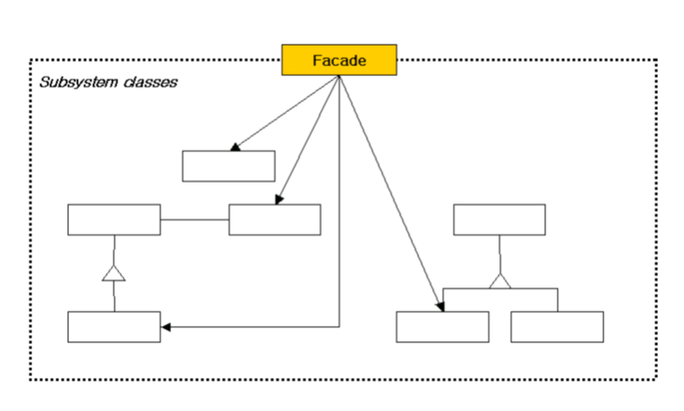

# 5. 퍼사드 \(Facade\)

## **의도**

한 서브시스템 내의 인터페이스 집합에 대한 획일화된 하나의 인터페이스를 제공하는 패턴으로, 서브시스템을 사용하기 쉽도록 상위 수준의 인터페이스를 정의합니다.

## **활용성**

퍼사드 패턴은 다음의 경우에 사용합니다.

* 복잡한 서브시스템에 대한 단순한 인터페이스 제공이 필요할 때. 퍼사드 패턴은 서브시스템에 대한 단순하면서도 기본적인 인터페이스를 제공함으로써 대부분의 개발자들에게 적합한 클래스 형태를 제공합니다.
* 추상 개념에 대한 구현 클래스와 사용자 사이에 너무 많은 종속성이 존재할 때. 서브시스템에 정의된 모든 인터페이스가 공개되면 빈번한 메서드 호출이 있을 수 있으나, 이런 호출은 단순한 형태로 통합하여 제공하고 나머지 부분은 내부적으로 처리함으로써 사용자와 서브시스템 사이의 호출 횟수는 실질적으로 감소하게 되는 효과를 갖습니다.
* 서브시스템을 계층화시킬 때. 퍼사드 패턴을 사용하여 각 서브시스템의 계층에 대한 접근점을 제공합니다. 서브시스템 내부 설계의 변경이 다른 서브시스템에 독립적으로 자유롭게 될 수 있는 것입니다.

## **구조**

## **결과**

퍼사드 패턴을 사용하면 얻는 이익은 다음과 같습니다.

#### **서브시스템의 구성요소를 보호할 수 있습니다.**

#### **서브시스템과 사용자 코드 간의 결합도를 더욱 약하게 만듭니다.**

#### **응용프로그램 쪽에서 서브시스템 클래스를 사용하는 것을 완전히 막지는 않습니다. 그러므로 Facade를 사용할지 서브시스템 클래스를 직접 사용할지 결정할 수 있습니다.**

## **구현**

퍼사드 패턴을 구현하기 위해 고려할 사항들을 알아봅시다.

#### **사용자와 서브시스템 간의 결합도 줄이기**

사용자와 서브시스템 간의 의존성을 줄이는 방법은 Facade를 추상 클래스로 정의하고, 서브시스템을 나타내기 위해 이를 상속하는 구체 서브클래스를 정의하여 다른 구현을 정의하도록 하는 것입니다. 그러면 사용자는 Facade만 사용하기 때문에, 어떤 서브시스템의 구현이 사용되고 있는지 알 필요가 없게 됩니다.

#### **서브시스템 클래스 중 공개할 것과 감출 것**

서브시스템은 클래스와 유사합니다. 클래스의 인터페이스를 정의할 때 공개할지 말지를 고민하는 것처럼 서브시스템의 인터페이스도 공개할지 말지를 생각해 봐야 합니다. 

