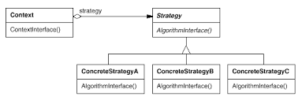

# 9. 전략 \(Strategy\)

## **의도**

동일 계열의 알고리즘군을 정의하고, 각 알고리즘을 캡슐화하며, 이들을 상호교환이 가능하도록 만듭니다. 알고리즘을 사용하는 클라이언트와 상괍없이 독립적으로 알고리즘을 다양하게 변경할 수 있습니다.

## **다른 이름**

정책\(Policy\)

## **활용성**

다음 상황에서 전략 패턴을 사용할 수 있습니다.

* 행동들이 조금씩 다를 뿐 개념적으로 관련된 많은 클래스들이 존재할 때.
* 알고리즘의 변형이 필요할 때.
* 사용자가 몰라야 하는 데이터를 사용하는 알고리즘이 있을 때. 노출하지 말아야 할 복잡한 자료 구조는 Strategy 클래스에만 두면 되므로 사용자는 몰라도 됩니다.
* 하나의 클래스가 많은 행동을 정의하고, 이런 행동들이 그 클래스의 연산 안에서 복잡한 다중 조건문의 모습을 취할 때. 많은 조건문보다는 각각을 Strategy 클래스로 옮겨놓는 것이 좋습니다.

## **구조**

## **결과**

전략 패턴에는 다음과 같은 장점과 단점이 있습니다.

#### **동일 계열의 관련 알고리즘군이 생깁니다.**

이런 알고리즘 자체의 재사용도 가능합니다.

#### **서브클래싱을 사용하지 않는 대안입니다.**

서로 다른 행동을 제공하기 위해 context 클래스를 직접 상속받을 수도 있습니다. 그러나 이렇게 행동의 처리 방법을 Context에 직접 코딩하면 추후 수정이 어렵습니다. 즉, Context 자체의 행동과 알고리즘이 혼합되어 Context 클래스를 이해하거나 유지보수하기 어렵습니다. 단순히 알고리즘에서만 차이를 보이는 데도 여러 클래스들을 마구 만들어 내는 셈입니다.

#### **조건문을 없앨 수 있습니다.**

#### **구현의 선택이 가능합니다.**

#### **사용자\(프로그램\)는 서로 다른 전략을 알아야 합니다.**

사용자는 적당한 전략을 선택하기 전에 전략들이 어떻게 다른지 이해해야 합니다.

#### **Strategy 객체와 Context 객체 사이에 의사소통 오버헤드가 있습니다.**

서브클래스에서 구현할 알고리즘의 복잡함과는 상관없이 모든 ConcreteStrategy 클래스는 Strategy 인터페이스를 공유합니다. 따라서 어떤 ConcreteStrategy 클래스는 이 인터페이스를 통해 들어온 모든 정보를 다 사용하지 않는데도 이 정보를 떠안아야 할 때가 생깁니다.

#### **객체 수가 증가합니다.**

전략들로 응용프로그램 내의 객체 수가 증가합니다.

## **구현**

전략 패턴을 구현할 때 신경써야 하는 이슈는 다음과 같습니다.

#### **Strategy 및 Context 인터페이스를 정의합니다.**

Strategy와 Context 인터페이스는 ConcreteStrategy가 Context에서 어떤 정보도 필요하다면 효율적으로 접근할 수 있고, 또 그 반대도 가능하도록 만들어져 있어야 합니다. Context가 데이터를 Strategy의 연산 쪽으로 보내는 방법과, 반대로 Context 객체가 자기 자신을 Strategy 객체에 인자로 보내고, Strategy 객체가 Context 객체에 데이터를 요청하는 방법이 있습니다. 후자의 방법에는 Context에 더 정교한 인터페이스를 구현해야 한다는 부담이 있습니다.

#### **전략을 템플릿 매개변수로 사용합니다.**

C++의 템플릿 기능\(java의 generic\)을 사용함으로써 전략을 가진 클래스를 구성할 수 있습니다.

#### **Strategy 객체에 선택성을 부여합니다.**

Strategy 객체를 갖지 않는 편이 나을 때, 기본 행동을 수행하도록 구현합니다.

## **의견**

Express 진영의 Auth를 담당하는 library인 passport를 보면, google-oauth-strategy, facebook-oauth-strategy 와 같은 straegy pattern 을 사용하는 것을 볼 수 있다. 암호화 알고리즘을 정하는 것도 좋은 예 중 하나 일 것이다.

